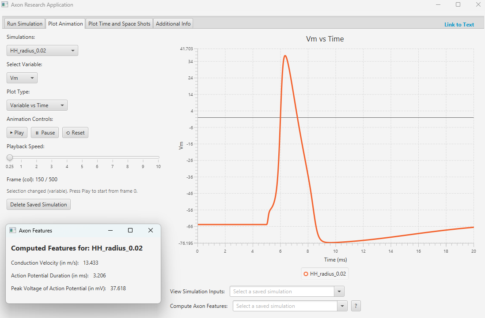
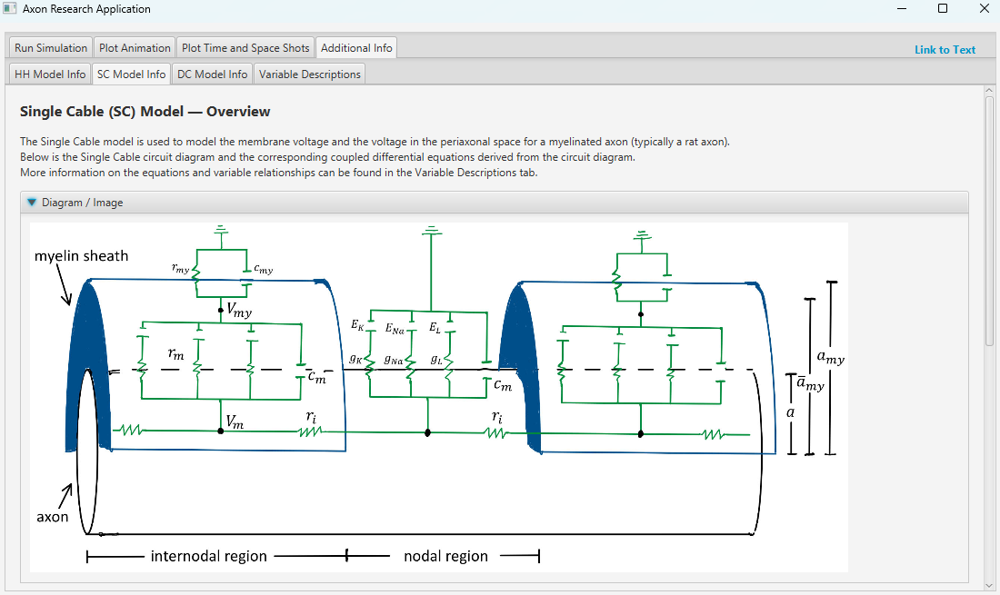

# axon-research-app-downloads

**Windows:** https://github.com/Kevin-Jay-Roberts21/axon-research-app-downloads/releases/latest/download/axon-research-app-windows-x64.msi

**Apple Silicon:** https://github.com/Kevin-Jay-Roberts21/axon-research-app-downloads/releases/latest/download/axon-research-app-macos-arm64.dmg

**Intel Macs:** https://github.com/Kevin-Jay-Roberts21/axon-research-app-downloads/releases/latest/download/axon-research-app-macos-x64.dmg

### Download Instructions
Since this app is disctributed through GitHub (and not through an official app store), your computer may warn that the installer is from an "unidentified developer" or "potential unsafe source." This is expected, the app does not contain malware, it simply hasn't been code-signed with a commercial developer license.

**On Windows:** You may see a SmartScreen warning. To continue, click "More Info" and then "Run anyway".

**On MacOS:** You may see a message that the app "cannot be opened because it is from an inidentified developer." To proceed, right-click (or Control-click) the app, select "Open," and confirm.

Once you bypass this initial check, the app will install and run normally.

## Axon Simulator App Information
The Axon Simulator App allows a user to experiment with axon voltage behaviors based on various axonal properties via user inputs. This app is based off of the research project Modeling and Analysis of Electric Signal in Neurons found [here](https://digitalcommons.usu.edu/gradreports2023/120/). The app consists of four main pages which are described below.

### Run Simulation
In this page, a user has the option to run a Hodgkin-Huxley (HH), Single Cable (SC) or Double Cable (DC) simulation. In each simulation tab, a user is prompted to enter Mesh and Axon Geometry Parameters, Material and "Per unit Length" Parameters and Other Parameters. If a user is unsure about which parameters to enter are reason or appropriate, then they may make use of the Default Buttons, which automatically fill in the inputs with reasonable values. In each simulation page there is a question mark button "?" which may help the user understand more about the inputs and their simulation. 

After all inputs are filled, a user must enter a simulation name and click "Run Simulation". While a simulation is running, a user also has the option to "Cancel Simulation". After the simulation is complete, the data from the simulation is saved in a new folder that is automatically created in \Documents\ called \Axon Simulations\. After a simulation has been saved, a user may view the saved simulation in the Plot Animation or Plot Time and Space Shots tabs. WARNING: Data is not automatically deleted, each user is responsible for deleting their own saved simulations via \Documents\Axon Simulations\, or through the app. 

### Plot Animation
This page is designed to plot the animation of a saved simulation. A user must first select a saved simulation under "Simulations:", where multiple simulations may be selected at a time (Note: an HH simulation cannot be compared with a SC or a DC simulation, however SC and DC simulations may be compared). Then a user must select a variable to plot under "Select Variable:". Options include Vm, n, m or h (or Vmy if selection is of type SC or DC). Then a user must choose to plot under "Plot Type:" (Variable vs Time or Variable vs Space). Under "Animation Controls:", lie the 3 buttons "Play", "Pause" or "Reset" which are used to control the animation. The "Playback Speed:" slider controls the playback speed of the animation. Finally, a user may decide to delete a saved simulation by clicking on "Delete Saved Simulation". After deleting a saved simulation, it will no longer appear in the Simulation dropdown, and it is deleted from the \Documents\Axon Simulations\ folder. 

To the right of the inputs is the graph which displays the voltage from a saved simulation. Below the graph a user may select a saved simulation to 1) see what their inputs were for their simulation (under "View Simulation Inputs:") and 2) see what the calculated conduction velocity, action potential duration and peak voltage of action potential is of a saved simulation (under "Compute Axon Features:").

### Plot Time and Space Shots
Similar to the Plot Animation page, the user must pick a saved simulation, a variable, and a plot type. The next input is the physical units of the time (or space shots). These "shots" must be separated by a comma, and the program will provide default shots if none are entered. After all is selected and inputted, a user must click the "Plot" button to plot the time (or space) shots. Finally, like the Plot Animation page, a user has the option to delete a simulation, view simulation inputs, and compute axon features.

### Additional Info
There are 4 tabs on this page. The first 3 tabs describe the 3 models (HH, SC, and DC), their circuits diagrams, and their corresponding model equations and boundary/initial conditions. Finally, the Variable Descriptions tab provides a detailed explanation of each variable used in the equations, as well as other important equation relationships.

